# Turtlebot-arm-block-manipulation

**ROBOTICS ENGINEERING**

**“PICK AND PLACE” PROJECT REPORT**
--------------------------------------------------------------
**Presented by:**

**SOLÈNE GUILLAUME**

**ZAIN BASHIR**

**YAMID ESPINEL**

**1. INTRODUCTION:**

The scenario is split in six parts. The first part is Mapping &
Localization: the robot has to move to a goal point using a map. The
goal point is set to be in front of a first table. This first position
of the robot will be not precise.

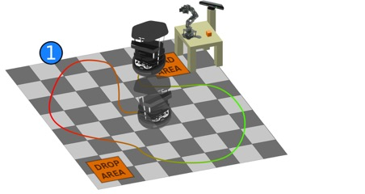

The second part is Fine positioning: with the help of visual servoing,
the robot has to be in a very precise position in the world, to adjust
the current position of the robot, so that we can perform pick and
place. A kinect on the robot is used to perform these two parts.

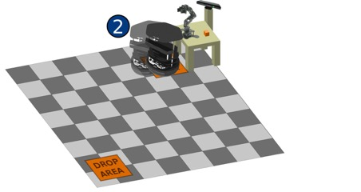

The third part, our part, is pick and place: with the robotic arm placed
on the first table, we have to pick a small cube from the table and
place it on the turtlebot. To do so, we are using a fixed kinect that
‘sees’ the arm, the table and the turtlebot. 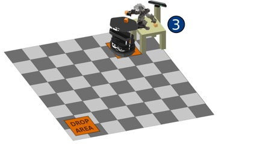

The fourth part is Mapping & Localization again: the robot has to go in
another goal point of the map, which is in front of a second table.
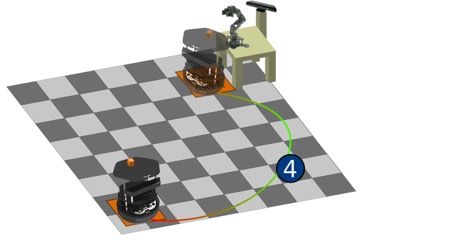

The fifth part is Fine positioning to put the robot precisely near the
second table. The sixth and last part is Pick & Place to put back the
cube to the second table using a second robotic arm and a second fixed
kinect.

As mentioned before, we have worked on pick and place. The arm that we
used was a PhantomX Pincher robot. It was previously assembled and
tested by the students from BSCV. We split our project into three parts:

1.  Kinect calibration: the calibration will help us to know the
    position of the camera in the 3D space, locating all the objects in
    the workspace and consequently giving the possibility to perform
    precise control of the robotic arm.

2.  Control of the robot arm: in a first time we will control the arm by
    controlling manually each joint of the arm. In a second time we will
    control the arm by planning a trajectory so that the arm will move
    to a goal position autonomously.

3.  Pick and place: we will detect the cube and plan a trajectory to
    pick and place it. This has to be completely autonomous and
    efficient.

<!-- end list -->

**2. ARM SETUP:**

To perform the pick and place task we first setup our PincherX arm and
the Kinect. As shown in figure 1, our Kinect is fixed to one corner of
the table while the arm is positioned exactly opposite, along the
diagonal.

|                       |                       |
| --------------------- | --------------------- |
| 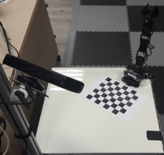 | 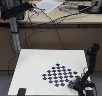 |
| (a)                   | (b)                   |
| 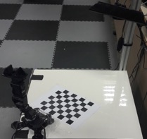 | 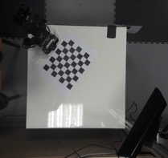 |
| (c)                   | (d)                   |

Figure 1: Kinect and arm setup. (a) Left view (b) Front view (c) Right
view (d) Top view

**3. ARM CALIBRATION:**

Arm calibration with reference to our task exclusively refers to getting
the position of our arm base inside the Kinect camera frame. To do this
we first place a checker board pattern of size 8x7 with each square of
size 27mm on the table. We then run the launch file named
*calibrate.launch* in the ROS terminal. This launch file contains the
code to detect the checker board pattern and give an image (figure 2)
which has four corner points labelled.

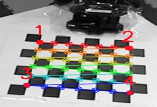

Figure 2: Labelled corner points

Once we have this image (figure 2) displayed on the screen, we place the
pincher on each point, in order, one at a time and press enter. The
placement of the pincher on these points is shown in the following
figure.

|                        |                        |
| ---------------------- | ---------------------- |
| 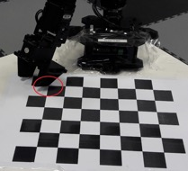 | 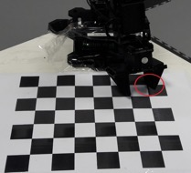 |
| (a)                    | (b)                    |
| 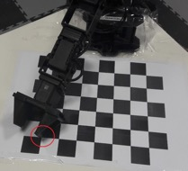 | 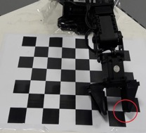 |
| (c)                    | (d)                    |

Figure 3: Placement of pincher on four corner points. (a) Point 1 (b)
Point 2 (c) Point 3 (d) Point 4

As soon as the pincher is placed on the last corner point (point 4), the
position of the arm base with respect to the camera is published. A line
similar to the one given below will be seen in the terminal which gives
the calibration parameters.

*rosrun tf static\_transform\_publisher 0.644927 -0.0369269 0.924532
-0.454811 -0.0169744 0.8893334 -0.0440946 /base\_link/camera\_link 100.*

To check the accuracy of the calibration we can run the command given
above in a separate terminal and check if the virtual arm is
superimposed to the real one as seen by the camera.

**4. THE ALGORITHM:**

In this stage of the experiment, we have to find a way to detect any
block on the table and make the robotic arm to grab it and put it on top
of the robot. The selected solution makes use of the
“turtlebot\_block\_manipulation” package **\[x\],** which is a set of
launch files and C++ programs that perform scene management, detection
of the blocks on the table, and movement of the arm; once executed, the
user can select one block in rviz and drag it to the desired position,
making the arm to pick the object and carry it to the final location.

4.1. Block detection:

This section of the program is done by the BlockDetectionServer class
(in the block\_detection\_action\_server.cpp file), which receives a
depth map and an execution order, and returns a list of the detected
blocks in the scene (see figure (x)). The block detection algorithm
contained there works by taking the depth map generated by the Kinect
camera and filtering it by height to leave only the points present
between the table height and the predetermined block size value, with
the help of a pcl::PassThrough object.

Once filtered, the largest planar object present in the remaining
pointcloud is segmented out by using a pcl::SACSegmentation object,
which will return the point indices that make part of the planar object
(table). By using these points, a pcl::ExtractIndices object lets us to
select and extract the points that are not part of the planar object so
in the end we obtain only the elements that are on top of the table.

Now, it’s the moment to check if the extracted elements correspond to
the desired blocks. First, the point cloud is divided in clusters of
25,000 points thanks to a pcl::EuclideanClusterExtraction object. For
each cluster, the external points are detected and so the maximum
cluster size is computed; the cluster will correspond to a block if it
fulfils all the following conditions:

(sb - t) < lx < (sb*sqrt(2) + t)

(sb - t) < ly < (sb*sqrt(2) + t)

t < lz < (sb + t)

where lx, ly, lz are the cluster’s dimensions in every
axis, sb is the size of the block to be detected and t is a
size tolerance set to 1 cm.

If the cluster contains a block then its center position is computed as:

xc = xmin + lx/2

yc = ymin + ly/2

zc = max - sb/2

where xc, yc, zc are the center coordinates of the
cluster/block, and xmin, ymin, zmin are the extreme
points of the block for each axis. These coordinates are then added into
the list of detected blocks, taking the arm’s frame as reference. One
example of the detection results can be seen in the following figure:

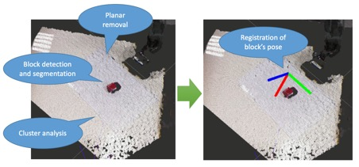

Figure 4: Block detection as seen in RViz

We have seen that sometimes the arm itself can be detected as a block,
as some of its components may resemble a cube. To fix this, we make the
robot go up so that there are no interferences between the camera and
the workspace, leaving just the blocks as the elements on top of the
table. This is done by adding a hard-coded final goal with a command
that makes the robot move straight-up in the
“block\_manipulation\_demo.cpp” file.

4.2. Interactive visualization and manipulation:

Once the BlockDetectionServer class has detected the desired blocks,
these are sent to the InteractiveManipulationServer class which will
show some 3D representations of the detected blocks in RViz and then it
will receive mouse inputs from the user, who has to click and grab one
of the blocks so that the arm takes and moves the block to the desired
position.

The algorithm starts by creating virtual 3D cubes for representing the
detected blocks in the table (using the addBlock method); these will be
located at the same positions as the real ones and will have a size
according to the predefined value (which should approximately math the
real block size), as shown in the figure (x).

Once these markers are inserted into memory and displayed, a callback
function InteractiveManipulationServer::feedbackCb is registered. This
function is activated whenever the user presses or releases the left
button and it performs different actions for each of these actions: if
the button is pressed down, this usually means the user has selected one
of the blocks so this initial position is stored in memory as an
old\_pose variable; once it has finished dragging the object and
releases it, the callback function will call the moveBlock method, which
will first correct the position of the block in Z by compensating the
arm’s bumper height and then will a message to a /pick\_and\_place topic
with the initial and final positions of the arm.

For our case, we have modified the code in such a way that as soon as
one block is detected, the arm will go and perform pick and place. To
achieve this, in the addBlock we have added some lines to set the
detected block as the pick position, while the drop position is hard
coded in such a way that the block is put on top of the Turtlebot; then
the moveBlock function is called and the arm starts performing the pick
and place.

4.3. Pick and place:

In order to make the robotic arm to take the block and put it on top of
the Turtlebot, the PickAndPlaceServer class will divide this task into
several steps so that the control of the arm is done more efficiently.
The arm’s movements are planned using the MoveIt\! interface, for which
the arm are the gripper are initialized as objects of type
moveit::planning\_interface::MoveGroup, letting us to set a target pose
and making the interface to compute the best trajectory to reach it:

1.  Open gripper: The gripper servo is set to a position in such a way
    that the block can fit into it.

2.  Rotate arm towards block’s position: The arm is moved at the xy
    position where the block is located, but keeping a predetermined z
    position (not taking the arm down to avoid collisions with the
    block).

3.  Move arm down to block’s z position: The arm is moved down until the
    position of the block in z, so that the gripper is able to enclose
    it.

4.  Close gripper: Make the gripper tightly grab the block.

5.  Lift arm up: Move the arm up to a predefined height while holding
    the block.

6.  Rotate arm towards final position: Arm is moved to a final
    predefined xy position where the block is going to be dropped. This
    position is supposed to be the location where the Turtlebot is right
    now.

7.  Move arm down to final z’s position: The arm takes the block down
    approximately to the same height as where the block was before.

8.  Open gripper: Move the gripper’s servo such that the block is
    released.

9.  Lift arm up: Move the arm up to a predefined height, so that the
    Turtlebot can take the block away without problems.

Once all the pick and place process is completed, a warning is sent to
the main process indicating the successful operation; like this, the
system will send a message to the robot to let it know that it can go to
the second table.

**5. COMMUNICATION WITH TURTLEBOT:**

Taking into account that the pick and place algorithm will start working
once the Navigation and the Visual Servoing tasks are done, there must
be a way for this last module to tell our system that its process has
finished. Once this notification arrives, the block detection and pick
and place tasks should be executed so that the block is finally put on
top of the robot.

We could opt for running our application in the Turtlebot along with the
other applications. But if we do that way, there will be some conflicts
with the topics being used by elements of the same type. For our case,
we are using a Kinect camera for the depth map generation, a type of
resource also used by the other two processes. If our code is run on the
same Turtlebot, the stream given by our Kinect camera will override
those from the cameras of the other groups, making their algorithms to
fail.

We look then for a method to send and receive messages between two
different roscores, finding that the Multimaster algorithm \[\] is one
of the easiest approaches to broadcast messages to a roscore that is not
sharing the same topics. In this Multimaster algorithm there are two
files to be modified: the config.yaml file which contains the list of
topics to be broadcasted, and the multimaster.launch file, in which we
have to specify the IP address of the computer where the chosen topics
are going to be sent.

Before the algorithm starts, it waits for a notification from the Visual
Servoing module which is running in the Turtlebot. Because it is the
robot the one who is going to send the message, the Multimaster package
is configured and compiled directly on it. Then, the servoing module
will send a finish notification through the “/robot\_status” topic,
which is remapped as “/relay/robot\_status” by Multimaster, making us to
listen through this last topic.

After all the pick and place process is done, the robot is also waiting
for a completion signal so that the second part of the Navigation
algorithm can take the robot to the second table. This makes us to also
install the Multimaster package in our workstation, configuring the
foreign IP to be that of the robot. Then, once our algorithm is
completed, it will send a signal through the “/arm\_status” topic, which
in the robot will be seen as “/relay/arm\_status”.

**6. INTEGRATION AND EXECUTION:**

All the modules that conform the project are automatically initialized
from a single .launch file, avoiding the necessity of running separate
files in order to get all the processes up and running. Among the nodes
and configuration parameters that are initialized in the
“block\_manip\_complete.launch” file, we find the following ones:

1)  Loading of transformation parameters after calibration.

2)  Turtlebot arm bringup files.

3)  Arbotix GUI.

4)  Robot description and configuration files (URDF, SRDF, .yaml, …)

5)  MoveIt\! framework to provide path planning.

6)  Kinect camera drivers.

7)  Block detection base services.

8)  And finally, our block manipulation program.

In order to run the program, the user must be sure of having all the
devices connected (Kinect camera, robotic arm). Sometimes the robotic
arm might need special access permissions, so we can run the following
command to give the necessary authorizations:

$ sudo chmod a+rw /dev/ttyUSB0

Once everything is set up, the program can be compiled using the Catkin
compiler by running catkin\_make from the Catkin workspace. The project
will be compiled under the name “turtlebot\_arm\_block\_manipulation”.
Once correctly compiled, it can be started by running the command:

$ roslaunch turtlebot\_arm\_block\_manipulation
block\_manip\_complete.launch

Once executed, an RViz window should appear with the scene on the
screen:

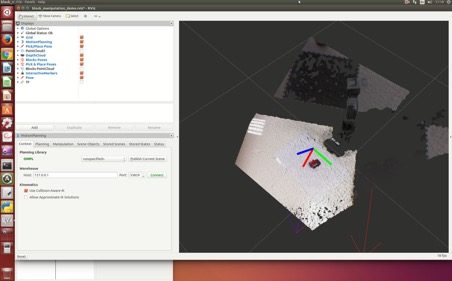

Figure 5: RViz showing the scene with the robotic arm and a detected
block

Then the program will wait for the completion message from the Visual
Servoing task and begin the block detection.
